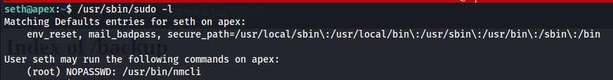
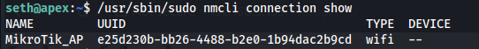
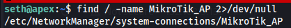
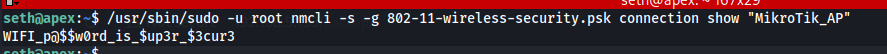
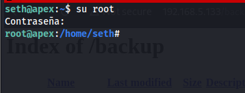
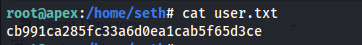
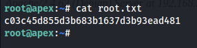

# Máquina shock

### Reconocimiento de la Ip de la máquina víctima

### Puertos abiertos

sudo nmap -sS --min-rate 6000 -p- --open -vvv -Pn 192.168.5.133

### Servicios y versiones 

sudo nmap -sVC --min-rate 6000 -p22,79,80 -vvv -Pn 192.168.5.133

### Fuzing web

feroxbuster --url http://192.168.5.133 -w /usr/share/wordlists/dirbuster/directory-list-2.3-medium.txt

me dice que tengo una respuesta 401 al directorio /backup

### Explotación

Entro a la web: http://192.168.5.133/

Me descargo la imagen y la subo a google para ver información de ella.

Encuenntro esto:

ahora como tengo finger corriendo hago lo siguiente:

finger horus@192.168.5.133

con las credenciales horus:H0Ru$$3rv3 inicio sesión en /backup

me descargo database.db

la abro con sqlite

sqlite3 database.db y veo las tablas

creo una lista de contraseñas con las credenciales y una lista de usuarios con los usernames y hago un ataque co hydra al puerto ssh

me conecto por ssh.

ssh seth@192.168.5.133

### Escalar privilegios

ejecuto sudo -l y me aparece el error:

entonces busco el binario sudo con el comando:

find / -name sudo -type f -exec ls -ld {} \; 2>/dev/null

el binario /usr/bin/nmcli es la herramienta de línea de comandos (CLI) para interactuar con NetworkManager, un servicio que gestiona las conexiones de red en sistemas Linux.

ver redes almacenadas:

ahora busco información sobre la red wifi MikroTik_AP 

ver contraseñas:

hago su root y escribo la contraseña encontrada

### user.txt

### root.txt

