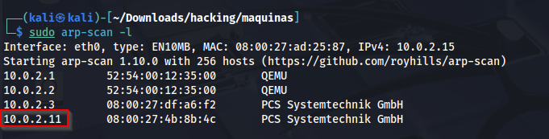

# Máquina Agent

### Reconocimiento de la Ip de la máquina víctima

### Puertos abiertos

sudo nmap -sS --min-rate 6000 -p- --open -vvv -Pn 192.168.42.151

### Servicios y versiones

sudo nmap -sVC --min-rate 6000 -p22,80 vvv -Pn 192.168.42.151

### Fuzzing Web

Cambiando el user-agent

wfuzz -c -t 200 --hc=404 -H "User-Agent: jorgas" -w /usr/share/seclists/Discovery/Web-Content/common.txt http://192.168.42.151/FUZZ

### Explotación

Entrando en http://192.168.42.151/websvn

buscamos un exploit en searchsploit

lo descargamos y modificamos:

lo ejecutamos:

nos ponemos en escucha con netcat en el puerto 443

### Escalar privilegios

Escalamos al usuario dustin

siendo el usuario dustin

### user.txt

### root.txt

