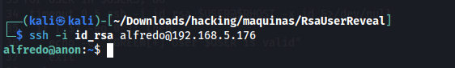
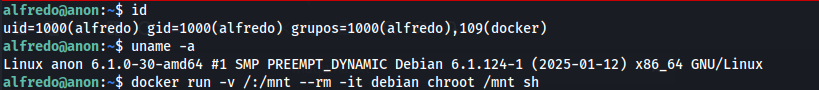
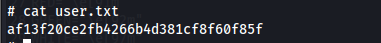
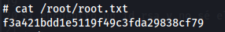

# Máquina Anon
### Reconocimiento de la Ip de la máquina víctima

### Puertos abiertos

sudo nmap -sS --disable-arp-ping --min-rate 6000 -p- --open -vvv -Pn 192.168.5.176

### Servicios y versiones

sudo nmap -sVC --min-rate 6000 -p22,80,873 -vvv -Pn 192.168.5.176

### Fuzzing Web

dirsearch -u http://192.168.5.176/ -r -w /usr/share/wordlists/dirbuster/directory-list-2.3-medium.txt

Entramos en la web: http://192.168.5.176/Anonymous-Connections/

Me pide que ingrese una ip, ingreso la ip de mi kali linux

me dió como resultado fue un escaneo de nmap:

abri el log en el directorio /victims

Creé un archivo robots y levanté un servidor web con python

y volví a realizar el escaneo y abrí el log:

Probé cambiando el Disallow por un código php:

volví a escanear:

subí el log a victims:

### Explotación

En el archivo robots.txt en la parte de Disallow coloqué un reverse shell en php y volví a escanear:

me puse en escucha con netcat por el puerto 443

subi el log a victims:

A primera vista verifiqué que no estaba en la máquina objetivo en sí, por lo tanto debía hacer movimiento lateral:

verifiqué los usuarios:

en /root encuentro una contraseña:

verifico la ip:

como realiza escaneo de puertos, realizo uno, para ver posibles ip's

ahora verifico sus puertos abiertos de la ip 10.10.10.20

nmap -sVC -vvv 10.10.10.20

Utilizando chisel:

en kali:

./chisel server -p 1234 --reverse

en víctima:
./chisel client 192.168.5.131:1234 R:2222:10.10.10.20:2222

me conecté por ssh con el usuario root y la contraseña anteriormente encontrada:
ssh root@192.168.5.131 -p 2222

en /root encontré un id_rsa lo copié y guardé en mí kali

usando la herramienta RsaUserReveal.sh de MatthyGD

Encontré al usuario

y me conecté por ssh

### Escalar privilegios

### user.txt

### root.txt

