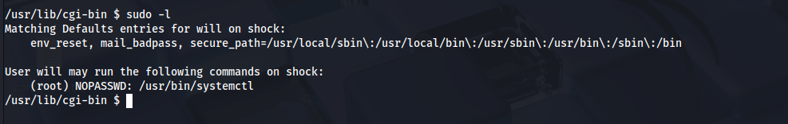

# Máquina Beginner

### Reconocimiento de la Ip de la máquina víctima

### Puertos abiertos

sudo nmap -sS --min-rate 6000 -p- --open -vvv -Pn 192.168.42.175

### Servicios y versiones 

sudo nmap -sV --script vuln -p22,80 --min-rate 6000 -vvv 192.168.42.175

### Entramos en la web

### Escaneo de puerto UDP

usando metasploit podemos ver que hay dentro de tftp

bajamos el archivo:

visualizo el tipo de archivo que es:

lo descomprimo:

entonces me descomprime una carpeta backup y dentro de ella archivos id_rsa y sshd_config, abrimos el archivo sshd_config

y visualiso un usuario boris:

entonces por ende el id_rsa le pertenece a boris

### Explotación

le damos pemrisos 600 al id_rsa y nos conectamos:

### Escalar privilegios

entonces vemos el id_rsa de root para conectarme:

### user.txt

### root.txt

