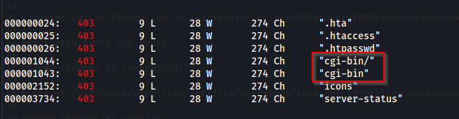

# Máquina Blogger

### Reconocimiento de la Ip de la máquina víctima

### Puertos abiertos

sudo nmap -sS --min-rate 6000 -p- --open -vvv -Pn 192.168.42.142

### Servicios y versiones

sudo nmap -sVC --min-rate 6000 -p22,80 vvv -Pn 192.168.42.142

### Fuzing web

gobuster dir -t 200 -u http://192.168.42.142/ -w /usr/share/wordlists/dirbuster/directory-list-2.3-medium.txt -x php,txt,bak,sh,py,js,html,db,png,jpg,git -b 403,404 2>/dev/null

al intentar acceder a http://192.168.42.142/wordpress/admin/ me sale lo siguiente:

lo agregamos al /etc/hosts

volví hacer gobuster esta vez al dominio.

gobuster dir -t 200 -u http://megablog.nyx/wordpress/ -w /usr/share/wordlists/dirbuster/directory-list-2.3-medium.txt -x php,txt,bak,sh,py,js,html,db,png,jpg,git -b 403,404 2>/dev/null

Enumeramos usuarios con wpscan:

wpscan --url http://megablog.nyx/wordpress -e p,u

hacemos ataque de fuerza bruta con wpscan:

wpscan --url http://megablog.nyx/wordpress/wp-login.php --usernames peter --passwords /usr/share/wordlists/rockyou.txt

### Explotación

Subí un plugin .zip con shell reverso en php

luego lo comprimí

luego subí el plugin y lo activé

me puse en escucha con netcat en el puerto 443

### Escalar privilegios

visualicé el archivo wp-config.php y pude encontrar las credenciales de root:

### user.txt

### root.txt

