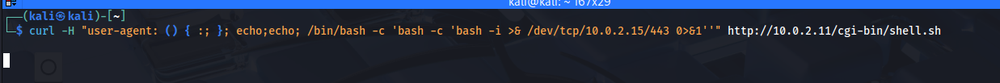

# Máquina Differentsec

### Reconocimiento de la Ip de la máquina víctima

### Puertos abiertos

sudo nmap -sS --min-rate 6000 -p- --open -vvv -Pn 192.168.42.145

### Servicios y versiones

sudo nmap -sVC --min-rate 6000 -p80 vvv -Pn 192.168.42.145

### Fuzzing web

gobuster dir -t 200 -u http://192.168.42.145/ -w /usr/share/wordlists/dirbuster/directory-list-2.3-medium.txt -x php,txt,bak,sh,py,js,html,db,png,jpg,git -b 403,404 2>/dev/null

### Explotación

Accedemos a la web:

y en la parte de abajo me da una opción para subir un archivo

Creamos un reverse shell llamado reverse.phtml con el código de pentestMonkey y lo subimos:

En Uploads:

nos ponemos en escucha 443 y le damos clic en reverse.phtml

hacemos tratamiento de la TTY

### Escalar privilegios

verificamos el /etc/crontab

se visualiza que el cronjob se ejecuta cada 1 min

verificamos los permisos:

entonces modificamos el archivo y colocamos el siguiente código:

nos ponemos en escucha con netcat:

### user.txt

### root.txt

