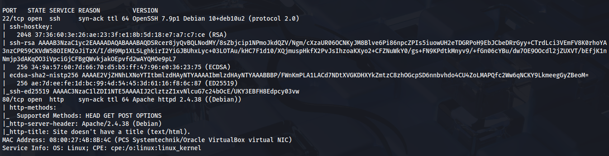
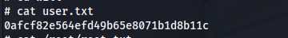

# Máquina First

### Reconocimiento de la Ip de la máquina víctima

### Puertos abiertos

sudo nmap -sS --min-rate 6000 -p- --open -vvv -Pn 192.168.42.173

### Servicios y versiones 

sudo nmap -sV --script vuln -p22,80,4369 --min-rate 6000 -vvv 192.168.42.173

### Fuzzing web

gobuster dir -t 200 -u http://192.168.42.173/ -w /usr/share/wordlists/dirbuster/directory-list-2.3-medium.txt -x php,txt,bak,sh,py,js,html,db,png,jpg,git -b 403,404 2>/dev/null

Descubrimos un directorio /tasklist

entramos en /tasklist

### Explotación

La tecnología Raspberry tiene credenciales por defecto para conexión ssh, usuario pi y contraseña raspberry.

al buscar binarios:

entonces me desconecté y volví a conectar

### Escalar privilegios

Ya que tenemos un cron que se ejecuta cada un min y apunta al /var/www/html

creamos un archivo para que se ejecute como root:

### user.txt

### root.txt

