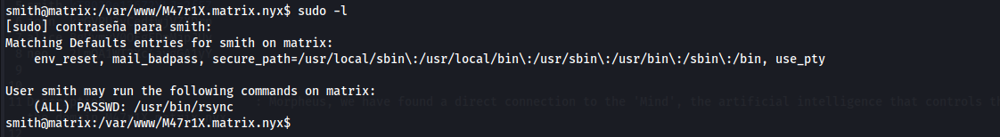
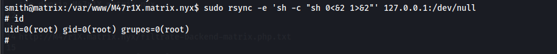
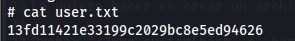
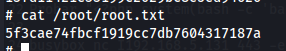

# Máquina Matrix
### Reconocimiento de la Ip de la máquina víctima

### Puertos abiertos

sudo nmap -sS --disable-arp-ping --min-rate 6000 -p- --open -vvv -Pn 192.168.5.177

### Servicios y versiones

sudo nmap -sVC --min-rate 6000 -p22,80 -vvv -Pn 192.168.5.177

### Fuzzing Web

feroxbuster --url http://192.168.5.177/ -r -w /usr/share/wordlists/dirbuster/directory-list-2.3-medium.txt

Me fui a ver la web:

observé el código fuente

hice fuzzing para encontrar el archivo .pcap

feroxbuster --url http://192.168.5.177/ -w /usr/share/wordlists/dirbuster/directory-list-2.3-medium.txt -x pcap

lo descargué y lo abrí con wireshark

encontré nombres de usuarios y contraseñas

encontré una imagen:

la descargué, le cambié el nombre y le apliqué exiftool

encontré un subdominio:

lo agregué al /etc/hosts y entré por url

después de muchos intentos:

entré al archivo:

### Explotación

Interceptamos con burpsuite y lo mandamos al repeater

coloco el siguiente objeto:

lo encodeo:

ahora en la url:

verifico si está el binario python3

me envío una reverse shell por el puerto 443, me coloco en escucha por dicho puerto

veo los usuarios:

cambio al usuario smith ya que había encontrado la contraseña previamente

### Escalar privilegios

siendo el usuario smith

### user.txt

### root.txt

