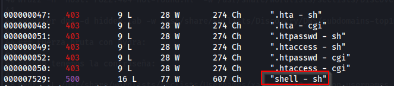

# Máquina Mux

### Reconocimiento de la Ip de la máquina víctima

### Puertos abiertos

sudo nmap -sS --min-rate 6000 -p- --open -vvv -Pn 192.168.42.156

### Servicios y versiones 

sudo nmap -sV --script vuln -p80,512,513,514 --min-rate 6000 -vvv 192.168.42.156

### Fuzzing web

gobuster dir -t 200 -u http://192.168.42.156/ -w /usr/share/wordlists/dirbuster/directory-list-2.3-medium.txt -x php,txt,bak,sh,py,js,html,db,png,jpg,git -b 403,404 2>/dev/null

entramos a la web y descargamos ls imagen de la Monna Lisa

aplicamos esteganografia, strings

Encontramos 2 contraseñas para el mismo usuario.

### Explotación

En el escaneo de servicios y versiones se puede ver que tiene activado el servicio exec con la version netkit-rsh rexecd que sirve para conexión remota.

rlogin 192.168.42.156 -l lisa

contraseña: Gi0c0nd@

### Escalar privilegios

ejecutamos:

### user.txt

### root.txt

