# Máquina Robot

### Reconocimiento de la Ip de la máquina víctima

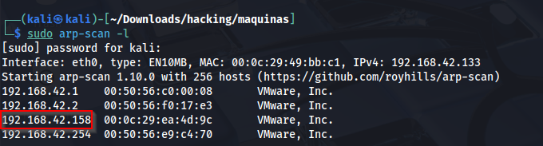

### Puertos abiertos

sudo nmap -sS --min-rate 6000 -p- --open -vvv -Pn 192.168.42.158

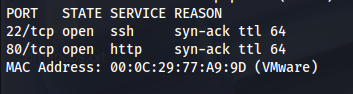

### Servicios y versiones 

sudo nmap -sV --script vuln -p22,80,27017 --min-rate 6000 -vvv 192.168.42.158

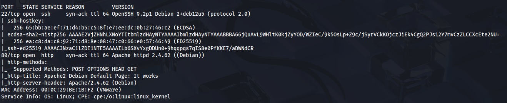

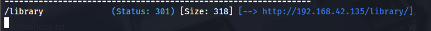

### Fuzzing web

gobuster dir -t 200 -u http://192.168.42.158/ -w /usr/share/wordlists/dirbuster/directory-list-2.3-medium.txt -x php,txt,bak,sh,py,js,html,db,png,jpg,git -b 403,404 2>/dev/null

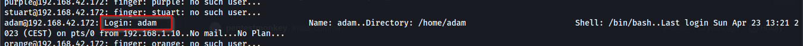

entramos a index.html

Descargamos la imagen:

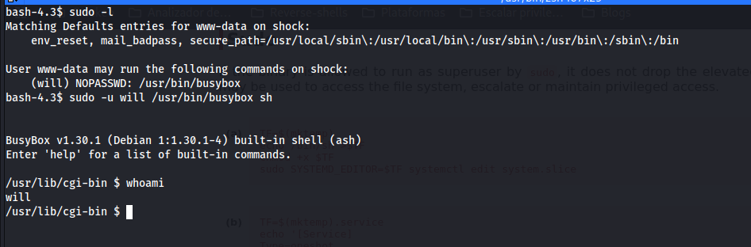

aplicamos esteganografia con exiftool:

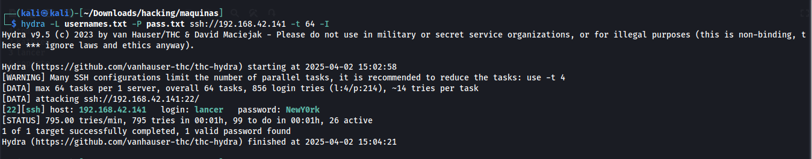

aplicamos gobuster otra vez:

gobuster dir -t 200 -u http://192.168.42.158/B4ckUp_3LLi0t/ -w /usr/share/wordlists/dirbuster/directory-list-2.3-medium.txt -x php,txt,bak,sh,py,js,html,db,png,jpg,git -b 403,404 2>/dev/null

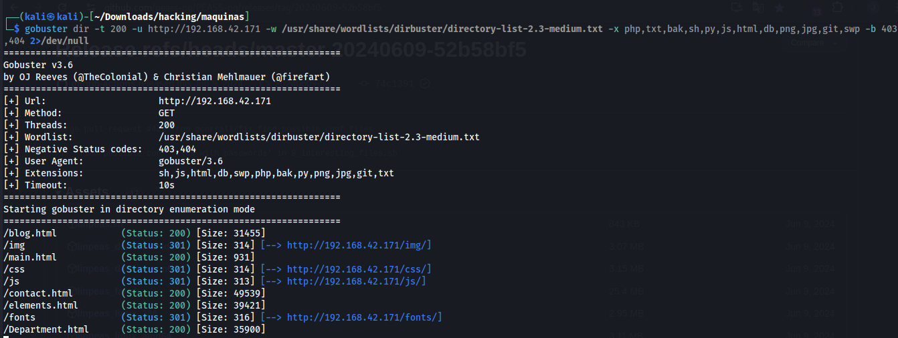

visualisamos lo que contiene connect.bak

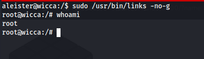

me conecto a mongodb con las credenciales encontradas hacia la base de dato elliot

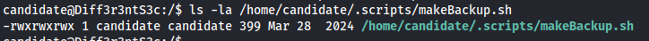

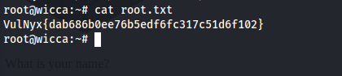

### Explotación

Usé la herramienta cupp para crear un diccionario de contraseñas con la información encontrada en mongodb

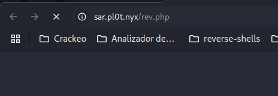

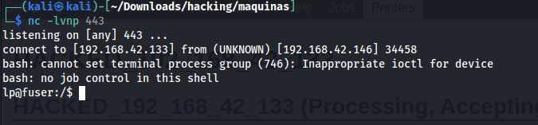

### Escalar privilegios

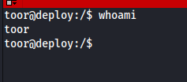

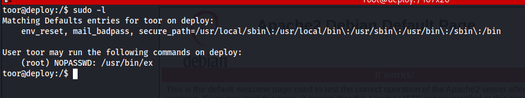

### user.txt

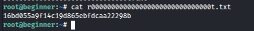

### root.txt

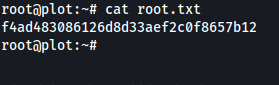