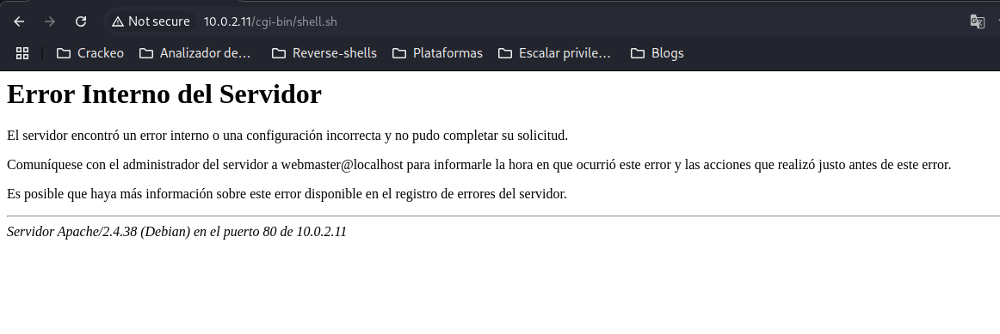

# Máquina noob

### Reconocimiento de la Ip de la máquina víctima

### Puertos abiertos

sudo nmap -sS --min-rate 6000 -p- --open -vvv -Pn 192.168.42.165

### Servicios y versiones 

sudo nmap -sVC --min-rate 6000 -p22,80 -vvv -Pn 192.168.42.165

### Fuzzing web

gobuster dir -t 200 -u http://192.168.42.165 -w /usr/share/wordlists/dirbuster/directory-list-2.3-medium.txt -x php,txt,bak,sh,py,js,html,db,png,jpg,git,swp -b 403,404 2>/dev/null

entramos en /notes.txt

cuando se cierra un editor como por ejemplo vim sin que se haya guardado queda un archivo .swp como respaldo

hacemos gobuster para encontrar el archivo .swp

vemos el archivo por la web:

### Explotación

escribimos el passphrase:

### Escalar privilegios

Para escalar privilegios utilicé la herramienta https://github.com/d4t4s3c/suForce

### user.txt

### root.txt

