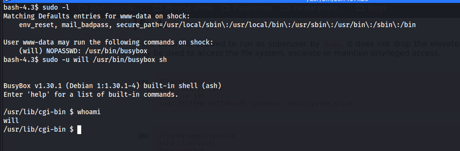

# Máquina zero

### Reconocimiento de la Ip de la máquina víctima

### Puertos abiertos

sudo nmap -sS --min-rate 6000 -p- --open -vvv -Pn 192.168.42.170

### Servicios y versiones 

sudo nmap -sVC --min-rate 6000 -p22,80,8080 -vvv -Pn 192.168.42.170

### Explotación

existe un exploit en searchsploit -> PHP 8.1.0-dev - 'User-Agentt' Remote Code Execution

lo descargamos 

searchsploit -m php/webapps/49933.py

observo el history y me conecto por ssh

### Escalar privilegios

### user.txt

### root.txt

